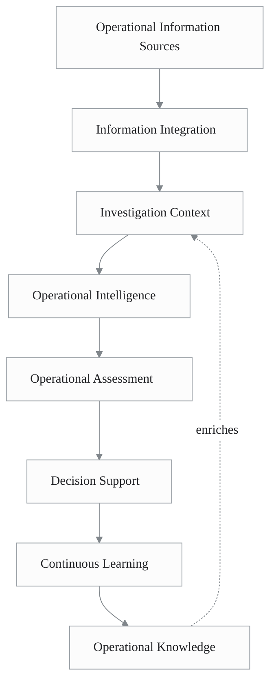
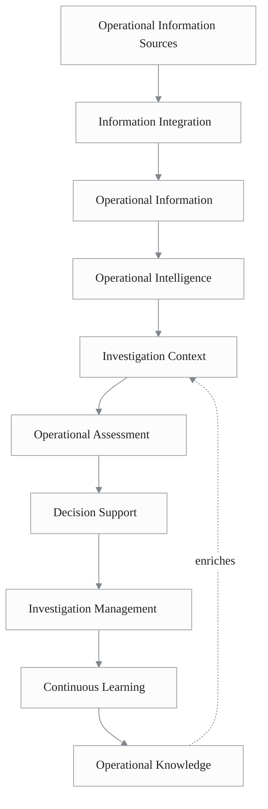
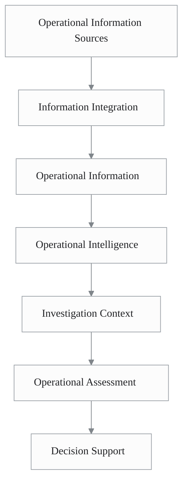
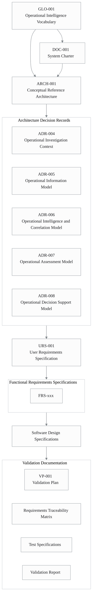

# ARCH-001: Conceptual Reference Architecture

| Attribute          | Value                             |
| ------------------ | --------------------------------- |
| **Document ID**    | ARCH-001                          |
| **Title**          | Conceptual Reference Architecture |
| **Status**         | Draft (RC2)                       |
| **Version**        | 0.9                               |
| **Classification** | Internal                          |
| **Owner**          | SMVS GmbH                         |
| **Author**         | Reinhold Sojer                    |
| **Reviewers**      | TBD                               |
| **Approver**       | TBD                               |
| **Effective Date** | TBD                               |
| **Supersedes**     | N/A                               |

---

# Revision History

| Version | Date       | Author         | Description             |
| ------- | ---------- | -------------- | ----------------------- |
| 0.9     | 2026-06-26 | Reinhold Sojer | First Release Candidate |

---

# Executive Summary

SMVS Operations is an **Operational Intelligence Platform** supporting the operation of the Swiss Medicines Verification System (NMVS) within the wider European medicines verification ecosystem.

The platform does not replace operational systems such as the Swiss NMVS or the EMVS Alert Management System (AMS) Hub. Instead, it integrates, contextualises and correlates operational information originating from multiple authoritative information sources to establish a comprehensive **Investigation Context**.

By transforming fragmented operational information into **contextual, actionable intelligence**, the platform supports evidence-based investigations, multidimensional Operational Assessments and explainable Decision Support. Its modular and technology-independent architecture enables the gradual integration of additional information sources, analytical capabilities and future AI-assisted investigation support while preserving human responsibility and the integrity of the underlying operational systems.

This document defines the conceptual reference architecture of SMVS Operations. It establishes the common terminology, architectural principles and conceptual models that form the foundation for all subsequent architecture, requirements, design and validation documentation.

---

# 1. Purpose

The purpose of this document is to define the conceptual reference architecture of the SMVS Operations platform.

It establishes a common understanding of the platform's architectural vision, terminology, conceptual capabilities and guiding principles. The document provides the conceptual foundation for architecture decisions, requirements engineering, software design and validation activities.

Rather than describing technical implementation, this document explains **how the platform is intended to operate conceptually**, **how fragmented operational information is transformed into contextual, actionable intelligence**, and **how this intelligence supports operational investigations and decision making**.

---

# 2. Document Scope

This document describes the conceptual architecture of SMVS Operations.

It defines:

- the architectural vision of the platform
- the common terminology used throughout the project
- the conceptual architecture
- the principal architectural capabilities
- the core concepts supporting operational investigations
- the architectural principles guiding future development

This document intentionally does **not** describe:

- software implementation
- databases
- APIs
- physical data models
- integration protocols
- software components
- deployment architecture

These aspects are specified in the corresponding Architecture Decision Records (ADRs), Functional Requirements Specifications (FRS), Software Design Specifications (SDS) and related implementation documentation.

---

# 3. Vision

**SMVS Operations transforms fragmented operational information into contextual, actionable intelligence to support evidence-based operational investigations and decision making.**

The platform integrates, contextualises and correlates information originating from multiple authoritative information sources to establish a comprehensive **Investigation Context**.

**Its primary objective is to support operational investigations by transforming operational information, organisational knowledge and analytical capabilities into explainable Operational Intelligence, Operational Assessment and Decision Support.**

The architecture is designed to remain modular, extensible and technology-independent, allowing additional information sources, intelligence domains and analytical capabilities to be incorporated without fundamental changes to the conceptual architecture.

# 4. Glossary

Unless stated otherwise, the terminology used throughout this document shall be interpreted according to **GLO-001 – Operational Intelligence Vocabulary**.

The glossary establishes the common terminology for all architecture, requirements, design and validation documentation.

The most important concepts used within this reference architecture include:

- Operational Information
- Evidence
- Investigation Context
- Operational Intelligence
- Operational Assessment
- Decision Support
- Operational Knowledge
- Continuous Learning

Where necessary, selected terms may be referenced within this document for explanatory purposes. The normative definitions are maintained exclusively in **GLO-001**.

# 5. Operational Intelligence Model

The conceptual architecture of SMVS Operations is centred around the transformation of fragmented operational information into contextual, actionable intelligence.

Operational information originating from multiple authoritative information sources is integrated, contextualised and correlated to establish an evolving **Investigation Context**. This context is continuously enriched with operational knowledge and evidence collected during the investigation.

The resulting Operational Intelligence supports multidimensional Operational Assessment and ultimately provides explainable Decision Support while preserving human responsibility for all operational decisions.

Continuous Learning ensures that completed investigations contribute to organisational knowledge, enabling the platform to continuously improve future investigations.

# 6. Architectural Principles

SMVS Operations is designed as an **Operational Intelligence Platform** supporting operational investigations within the medicines verification ecosystem.

The platform does not replace operational systems. Instead, it complements them by **integrating, contextualising and correlating** operational information originating from multiple authoritative information sources.

Operational investigations are not driven by isolated events. Instead, investigations are based on an evolving **Investigation Context**, established by combining operational information, evidence, organisational knowledge and analytical capabilities.

The architecture follows the principle that **information acquires value through context**. Individual events, exceptions or observations rarely provide sufficient evidence for operational decision making. Meaningful operational conclusions emerge by combining operational evidence, analytical intelligence and organisational knowledge.

To achieve this objective, the conceptual architecture distinguishes four complementary platform capabilities:

- **Information Integration** – integrating and contextualising operational information originating from multiple authoritative information sources.
- **Operational Intelligence** – deriving contextual intelligence through correlation, interpretation and analytical capabilities.
- **Operational Assessment** – evaluating operational situations from multiple complementary perspectives to support consistent and explainable investigations.
- **Decision Support** – supporting authorised investigators with contextual information, operational assessments and evidence-based recommendations while preserving human responsibility.

These capabilities are conceptually independent and may evolve without fundamentally affecting one another.

The architecture is therefore designed to accommodate additional operational information sources, intelligence domains, analytical capabilities and future technologies while preserving a stable conceptual foundation.

---

## Fundamental Principles

The conceptual architecture is based on the following principles.

### Context Creates Intelligence

Operational information acquires value through context. Context transforms fragmented operational information into contextual, actionable intelligence.

### Evidence before Conclusions

Operational evidence remains clearly distinguishable from analytical interpretations, operational assessments and recommendations.

### Intelligence through Correlation

Operational Intelligence emerges through the correlation of operational information originating from multiple authoritative information sources.

### Explainability

Operational Intelligence, Operational Assessments and Decision Support shall remain transparent and traceable to the underlying operational information and evidence.

### Human-centred Decision Making

The platform supports operational investigations and decision making but does not replace human judgement, organisational responsibility or regulatory accountability.

### Continuous Learning and Evolution

Completed investigations contribute to organisational knowledge, enabling continuous improvement of operational intelligence while allowing the architecture to evolve through the integration of new information sources, intelligence domains and analytical capabilities.

### Knowledge-driven Operations

Organisational knowledge complements analytical intelligence by incorporating operational experience, investigation guidelines, best practices and lessons learned into the investigation process.

# 7. Conceptual Capabilities

The conceptual architecture is organised around a set of complementary platform capabilities.

Each capability contributes to the transformation of fragmented operational information into contextual, actionable intelligence while preserving traceability to the underlying operational evidence.

The separation of concerns allows the platform to evolve by introducing new information sources, intelligence domains, assessment methods and investigation management capabilities without changing the overall conceptual architecture.

---

## 7.1 Operational Information Sources

Operational Information Sources represent authoritative sources from which the platform obtains operational information.

These sources may include operational systems, regulatory reference sources, open government data sources and future operational information sources.

Examples include:

- Swiss NMVS
- EMVS AMS Hub
- regulatory and open government data sources
- future operational information sources

The conceptual architecture intentionally abstracts from implementation details such as APIs, snapshots, reports or file formats.

---

## 7.2 Information Integration

Information Integration is responsible for integrating, validating, transforming, normalising and contextualising information obtained from Operational Information Sources.

Its responsibilities include:

- information integration
- validation
- transformation
- normalisation
- contextualisation
- versioning
- traceability

Information Integration establishes a consistent operational information foundation independent of individual source systems.

---

## 7.3 Operational Information

Operational Information represents the integrated and contextualised information used throughout the platform.

Operational Information provides the foundation for Operational Intelligence, Operational Assessment, Investigation Management and Decision Support.

It intentionally separates operational information from analytical interpretation, assessment outcomes and operational decisions.

---

## 7.4 Operational Intelligence

Operational Intelligence derives analytical understanding from Operational Information, Evidence and Operational Knowledge.

It enriches operational information by applying correlation, interpretation and analytical capabilities.

Operational Intelligence supports the generation of Operational Hypotheses and provides the analytical basis for Operational Assessment.

Current intelligence perspectives include, but are not limited to:

- product-related intelligence
- batch-related intelligence
- organisation-related intelligence
- behaviour-related intelligence
- technical and process-related intelligence
- operational knowledge

Future intelligence perspectives may be introduced without affecting the conceptual architecture.

---

## 7.5 Investigation Context

The Investigation Context combines relevant Operational Information, Evidence, Operational Intelligence and Operational Knowledge into a contextual view of an investigation.

It represents the primary working context for investigators and evolves as additional information becomes available.

The Investigation Context provides the basis for Operational Assessment, Decision Support and Investigation Management.

---

## 7.6 Operational Assessment

Operational Assessment evaluates the Investigation Context from multiple complementary perspectives.

Its purpose is to support operational relevance assessment, likely-cause analysis, prioritisation, investigation planning and operational decision making.

Operational Assessment assists investigators but does not replace human judgement, organisational responsibility or regulatory accountability.

---

## 7.7 Operational Decision Support

Operational Decision Support represents the presentation of Operational Intelligence and Operational Assessment to authorised stakeholders.

Decision Support may include:

- investigation summaries
- dashboards
- operational reports
- assessment outputs
- recommended next steps
- AI-assisted recommendations
- future analytical capabilities

Decision Support consumes the Investigation Context and Operational Assessment while maintaining traceability to the underlying operational evidence.

---

## 7.8 Investigation Management

Investigation Management supports the structured handling, documentation and follow-up of operational investigations.

It provides capabilities to track the lifecycle of an investigation, including status, responsibilities, timelines, communication, evidence, assessment outcomes and closure information.

Investigation Management is distinct from Operational Intelligence and Operational Assessment. Its purpose is not to generate analytical conclusions, but to ensure that investigations are documented, traceable, auditable and followed up appropriately.

Typical capabilities may include:

- investigation status tracking
- assignment of responsibilities
- documentation of investigation actions
- tracking of MAH or stakeholder responses
- deadline and follow-up monitoring
- documentation of likely cause and conclusion
- references to related QMS records where applicable
- audit trail of investigation activities

Investigation Management complements, but does not replace, existing QMS processes.

------

# 8. Conceptual Reference Architecture

The Conceptual Reference Architecture describes how SMVS Operations transforms fragmented operational information into contextual, actionable intelligence supporting operational investigations.

The architecture is intentionally technology-independent. It focuses on the conceptual capabilities of the platform and the logical transformation of operational information rather than implementation details.

Operational Information Sources provide authoritative operational information to the platform. Through Information Integration, this information is validated, contextualised and made available as Operational Information.

Operational Intelligence establishes an evolving Investigation Context by combining Operational Information with Operational Knowledge, Evidence and analytical capabilities. The resulting Investigation Context supports multidimensional Operational Assessment and evidence-based Decision Support while maintaining complete traceability to the underlying operational information.

Investigation Management complements these capabilities by supporting the structured documentation, coordination and follow-up of operational investigations throughout their lifecycle.

---

## 8.1 Conceptual Reference Architecture

The diagram illustrates the principal conceptual capabilities of SMVS Operations and their relationships.

Operational Information flows through a sequence of complementary capabilities that progressively enrich its operational value. Investigation Management accompanies the operational investigation lifecycle, while Continuous Learning ensures that completed investigations contribute to organisational knowledge and continuously improve future investigations.

---

## 8.2 Operational Intelligence Flow

The conceptual architecture follows a progressive transformation of operational information into contextual, actionable intelligence.

Each capability enriches the previous one while preserving complete traceability to the originating operational information and evidence.

This separation of concerns enables each capability to evolve independently without fundamentally affecting the conceptual architecture.

---

## 8.3 Architectural Characteristics

The conceptual architecture exhibits the following characteristics.

### Information-centric

Operational Information represents the primary architectural asset. Operational systems act as authoritative Information Sources.

### Context-driven

Operational investigations are based on Investigation Context rather than isolated operational events.

### Evidence-based

Operational Intelligence, Operational Assessment and Decision Support remain traceable to objective operational information and evidence.

### Explainable

Operational Intelligence and Operational Assessments remain transparent, understandable and reproducible.

### Modular

Conceptual capabilities evolve independently while maintaining stable interfaces and responsibilities.

### Extensible

The architecture accommodates additional information sources, analytical capabilities and future technologies without requiring fundamental architectural changes.

### Technology-independent

The conceptual architecture intentionally avoids implementation-specific concepts and remains independent of programming languages, databases, APIs or deployment technologies.

### Continuously Learning

Completed investigations continuously strengthen organisational knowledge and improve future operational investigations.

# 9. Operational Intelligence

Operational Intelligence transforms Operational Information into contextual analytical understanding supporting investigations, Operational Assessment and Decision Support.

Rather than analysing individual operational events in isolation, the platform correlates information from multiple Operational Information Sources and interprets it within the relevant Investigation Context.

Operational Intelligence represents the analytical capability of the platform.

Its purpose is to identify operational relationships, patterns, anomalies, likely causes and contextual risks that would not be apparent when analysing individual information sources independently.

Operational Intelligence complements operational expertise by providing contextual understanding rather than replacing human judgement.

---

## 9.1 Intelligence Perspectives

Operational Intelligence may be organised into specialised analytical perspectives.

Each perspective analyses Operational Information from a particular operational viewpoint while contributing to the shared Investigation Context.

These perspectives are intentionally independent, allowing analytical capabilities to evolve incrementally without affecting the overall conceptual architecture.

Examples include:

- product-related intelligence
- batch-related intelligence
- organisation-related intelligence
- behaviour-related intelligence
- technical and process-related intelligence
- regulatory and reference-data intelligence
- operational knowledge

Future intelligence perspectives may be introduced without affecting the conceptual architecture.

---

## 9.2 Investigation Context

The Investigation Context represents the convergence of relevant Operational Information, Evidence, Operational Intelligence and Operational Knowledge.

Rather than presenting isolated analytical findings, the platform assembles the information required to understand an operational situation in context.

The Investigation Context is the primary analytical working context of the platform.

Operational investigations are performed against the Investigation Context rather than against individual Alerts, Exceptions or operational events.

---

## 9.3 Investigation Management

Investigation Management supports the structured execution, documentation and follow-up of operational investigations.

While Operational Intelligence provides analytical understanding and Operational Assessment supports evidence-based evaluation, Investigation Management governs the operational lifecycle of an investigation.

Typical capabilities include:

- investigation status management
- assignment of responsibilities
- documentation of investigation activities
- evidence management
- communication with stakeholders
- tracking of MAH and NCA responses
- deadline monitoring
- investigation closure
- references to related QMS records
- complete investigation audit trail

Investigation Management complements Operational Intelligence but remains conceptually independent from analytical capabilities.

------

## 9.4 Operational Hypotheses

Operational Intelligence supports the generation of Operational Hypotheses.

An Operational Hypothesis is a plausible explanation for an observed operational situation based on the available Operational Intelligence.

Multiple Operational Hypotheses may coexist until sufficient evidence becomes available.

Operational Hypotheses provide the basis for Operational Assessment.

---

## 9.5 Design Principles

Operational Intelligence follows the principles below.

### Correlation over Isolation

Operational information shall be interpreted through correlation rather than isolated analysis.

### Context over Events

Operational context provides greater analytical value than individual operational events.

### Knowledge over Rules

Operational Knowledge complements analytical models and supports consistent operational investigations.

### Human-centred Intelligence

Operational Intelligence informs investigators but does not replace operational responsibility.

### Continuous Learning

Operational Intelligence shall evolve continuously as additional information sources, investigation outcomes, analytical capabilities and Operational Knowledge become available.

---

# 10. Architectural Principles

The conceptual reference architecture is governed by the following architectural principles.

---

## 10.1 Information as a Strategic Asset

Operational Information is a primary architectural asset of the platform.

Operational Information shall remain independent of individual operational systems and be reusable across multiple analytical and operational capabilities.

---

## 10.2 Evidence-based Operations

Operational investigations shall be based on objective evidence collected from authoritative Operational Information Sources.

Evidence shall remain distinguishable from analytical interpretation, Operational Assessment, recommendations and operational decisions.

---

## 10.3 Context-driven Investigations

Operational investigations shall be performed within an Investigation Context rather than on isolated operational events.

Context is established by combining Operational Information, Evidence, Operational Intelligence and Operational Knowledge.

---

## 10.4 Separation of Concerns

The architecture separates the following conceptual capabilities:

- Operational Information Sources
- Information Integration
- Operational Information
- Operational Intelligence
- Investigation Context
- Operational Assessment
- Decision Support
- Investigation Management
- Continuous Learning

Each capability shall evolve independently while preserving traceability and conceptual consistency.

---

## 10.5 Modularity

Operational Information Sources, analytical capabilities, assessment methods, Decision Support capabilities and Investigation Management capabilities shall be loosely coupled.

The introduction of new capabilities shall not require fundamental architectural changes.

---

## 10.6 Technology Independence

The conceptual architecture intentionally avoids implementation-specific technologies.

Implementation details shall be documented in Architecture Decision Records, Functional Requirements Specifications and Software Design Specifications.

---

## 10.7 Human-centred Decision Support

Operational decisions remain the responsibility of authorised human operators or authorised stakeholders.

Analytical services, including AI-assisted capabilities, provide Decision Support but do not perform autonomous operational decisions.

---

## 10.8 Explainability

Operational Intelligence, Operational Assessment and Decision Support shall remain understandable and traceable.

Where analytical recommendations are generated, investigators shall be able to understand the underlying Operational Information, Evidence, correlations and Assessment Dimensions.

---

## 10.9 Continuous Learning

The platform shall continuously evolve through:

- operational experience
- investigation outcomes
- organisational knowledge
- new Operational Information Sources
- additional analytical perspectives
- improved assessment methods
- analytical improvements

Continuous Learning strengthens Operational Intelligence while preserving traceability, explainability and regulatory compliance.

---

# 11. Relationship to Other Documents

This document establishes the conceptual foundation for the SMVS Operations documentation framework.

The documentation hierarchy is illustrated below.

Each document refines the architectural concepts established by this reference architecture while maintaining traceability throughout the system lifecycle.

---

# 12. Future Evolution

The conceptual architecture is intended to remain stable throughout the lifetime of the platform.

Future developments are expected to include:

- additional Operational Information Sources
- additional analytical perspectives
- enhanced Behaviour Intelligence
- expanded Operational Knowledge
- AI-assisted analytical and decision-support capabilities
- enhanced Investigation Management capabilities
- integration with future operational systems
- additional Decision Support services
- improved Continuous Learning from investigation outcomes

These extensions shall complement the existing conceptual architecture without altering its fundamental principles.

The conceptual separation between Operational Information, Operational Intelligence, Investigation Context, Operational Assessment, Decision Support, Investigation Management and Continuous Learning shall remain the foundation of the platform.

---

# 13. Document Maintenance

This document represents the conceptual reference architecture of the SMVS Operations platform.

The document is intended to remain stable throughout the lifetime of the platform.

Future revisions should be limited to changes affecting the conceptual architecture, architectural principles or core conceptual capabilities.

Implementation details, technology choices and detailed design decisions shall be documented in the corresponding Architecture Decision Records (ADRs), Functional Requirements Specifications (FRS) and Software Design Specifications (SDS).

Terminology used in this document shall remain aligned with **GLO-001 – Operational Intelligence Vocabulary**.

---

# Appendix A – Abbreviations

| Abbreviation | Description                                       |
| ------------ | ------------------------------------------------- |
| AI           | Artificial Intelligence                           |
| AMS          | Alert Management System                           |
| ADR          | Architecture Decision Record                      |
| EMVS         | European Medicines Verification System            |
| FRS          | Functional Requirements Specification             |
| GTIN         | Global Trade Item Number                          |
| IDMP         | Identification of Medicinal Products              |
| IMT          | Inter-Market Transaction                          |
| MAH          | Marketing Authorisation Holder                    |
| NCA          | National Competent Authority                      |
| NMVO         | National Medicines Verification Organisation      |
| NMVS         | National Medicines Verification System            |
| OBP          | Onboarding Partner                                |
| OGD          | Open Government Data                              |
| QMS          | Quality Management System                         |
| SAI          | Swissmedic Authorised Medicines Information       |
| SDS          | Software Design Specification                     |
| SPOR         | Substance, Product, Organisation and Referentials |
| URS          | User Requirements Specification                   |

---

# Appendix B – References

| Reference                           | Description                                                 |
| ----------------------------------- | ----------------------------------------------------------- |
| GLO-001                             | Operational Intelligence Vocabulary                         |
| DOC-001                             | System Charter                                              |
| ADR-004                             | Operational Investigation Context                           |
| ADR-005                             | Operational Information Model                               |
| ADR-006                             | Operational Intelligence and Correlation Model              |
| ADR-007                             | Operational Assessment Model                                |
| ADR-008                             | Operational Decision Support Model                          |
| URS-001                             | User Requirements Specification                             |
| VP-001                              | Validation Plan                                             |
| GAMP® 5                             | A Risk-Based Approach to Compliant GxP Computerized Systems |
| EMVS Functional Specification       | Current applicable version                                  |
| EMVS Alert Management Specification | Current applicable version                                  |