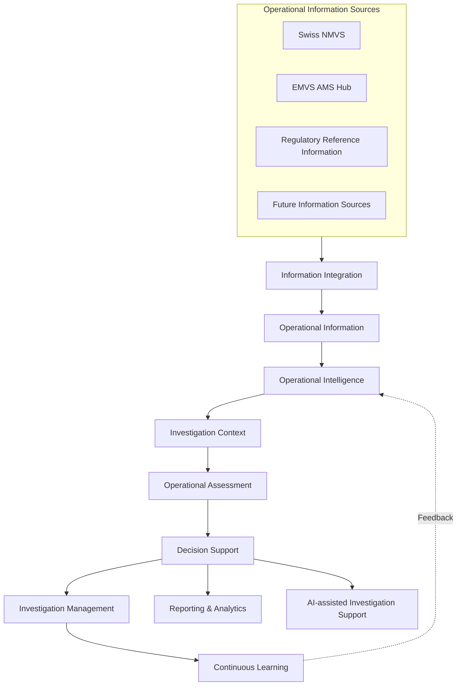

# System Charter

# 1. Purpose

The purpose of **SMVS Operations** is to provide a validated Operational Intelligence Platform for the Swiss National Medicines Verification System (NMVS).

The platform supports SMVS in conducting evidence-based operational investigations by integrating, contextualising and correlating operational information originating from the NMVS and related authoritative information sources.

SMVS Operations supports the transformation of fragmented operational information into Operational Intelligence, Operational Assessment, Decision Support and Investigation Management.

The platform is intended for internal operational use by SMVS. It provides operational intelligence and investigation support without replacing the Swiss NMVS, the EMVS AMS Hub or other authoritative operational systems.

SMVS Operations is an observational platform. It consumes operational information from authoritative information sources but does not participate in transactional NMVS operations.

# 2. Vision

SMVS Operations is the central Operational Intelligence Platform supporting evidence-based operational investigations for the Swiss NMVS.

The platform transforms fragmented operational information into contextual, actionable intelligence by integrating, contextualising and correlating information from multiple authoritative sources.

It supports SMVS throughout the investigation lifecycle, including operational understanding, assessment, decision support, documentation, follow-up and continuous organisational learning.

The platform is designed to remain modular, extensible and technology-independent, enabling future integration of additional information sources, analytical capabilities, AI-assisted investigation support and enhanced Investigation Management.

# 3. Scope

## Scope v1

SMVS Operations provides the following conceptual platform capabilities:

- Information Integration
- Operational Information
- Operational Intelligence
- Operational Assessment
- Decision Support
- Investigation Management
- Reporting & Analytics
- AI-assisted Investigation Support
- Audit Logging

### Information Integration

Integrates operational information from multiple authoritative information sources into a consistent operational information foundation.

Responsibilities include:

- information acquisition
- validation
- transformation
- normalisation
- contextualisation
- versioning
- traceability

Supported information sources initially include:

- NMVS Snapshots

- Exceptions API

- Regulatory Reference Information

  [^1]: Regulatory Reference Information may include authorised medicines information, product reference data, regulatory publications, shortage information and other structured reference data relevant to operational investigations.

- future operational information sources

### Operational Information

Provides an integrated operational representation of the medicines verification ecosystem.

Operational Information establishes relationships between operational entities while preserving complete traceability to the originating information sources.

It provides the foundation for Operational Intelligence, Operational Assessment and Investigation Management.

### Operational Intelligence

Transforms Operational Information into contextual, actionable intelligence supporting operational investigations.

Current analytical perspectives include:

- Product Intelligence
- Batch Intelligence
- Organisation Intelligence
- Behaviour Intelligence
- Exceptions Intelligence
- future analytical perspectives

Operational Intelligence establishes Investigation Contexts through correlation, contextualisation and analytical interpretation.

### Operational Assessment

Supports evidence-based evaluation of operational situations from multiple complementary perspectives.

Operational Assessment assists investigators in understanding operational significance, likely causes, priorities and appropriate follow-up actions.

Operational Assessments remain explainable and fully traceable to the underlying Operational Information and Evidence.

### Decision Support

Provides investigators with contextual information supporting operational decision making.

Typical capabilities include:

- dashboards
- reports
- operational analytics
- explainable recommendations
- AI-assisted investigation support

### Decision Support

Provides investigators with contextual information supporting operational decision making.

Typical capabilities include:

- dashboards
- reports
- operational analytics
- explainable recommendations
- AI-assisted investigation support

### Reporting & Analytics

Provides operational dashboards, reports, KPIs and analytical views supporting operational monitoring, investigations and management reporting.

### AI-assisted Investigation Support

Provides AI-assisted analysis supporting Operational Intelligence, Operational Assessment and Decision Support.

AI supports investigators by generating explainable recommendations, highlighting relevant operational context and identifying analytical patterns.

AI shall not perform autonomous operational decisions.

### AI-assisted Investigation Support

Provides AI-assisted analysis supporting Operational Intelligence, Operational Assessment and Decision Support.

AI supports investigators by generating explainable recommendations, highlighting relevant operational context and identifying analytical patterns.

AI shall not perform autonomous operational decisions.

## Out of Scope v1

The following capabilities are explicitly outside the scope of the initial release:

- transactional interaction with the Swiss NMVS
- modification of production NMVS data
- replacement of the EMVS Alert Management System (AMS)
- automated operational decision making
- autonomous investigation closure
- direct execution of regulatory processes
- replacement of existing Quality Management System (QMS) processes
- operational actions performed on behalf of MAHs, OBPs or End Users

# 4. Stakeholders

## Internal Stakeholders

The primary users of SMVS Operations are internal SMVS personnel responsible for operating and supporting the Swiss NMVS.

- SMVS Operations
- SMVS Customer Support
- SMVS Management
- SMVS IT Administration

---

## External Stakeholders

SMVS Operations supports investigations involving multiple participants within the medicines verification ecosystem.

Examples include:

- National Competent Authority (Swissmedic)
- Marketing Authorisation Holders (MAHs)
- Onboarding Partners (OBPs)
- Community Pharmacies
- Hospital Pharmacies
- Pharmaceutical Wholesalers
- Blueprint Provider
- EMVO

---

## Information Providers

Operational information may originate from multiple authoritative information sources, including:

- Swiss NMVS
- EMVS AMS Hub
- Regulatory Reference Information
- future operational information sourcesSehr 

# 5. High-Level Architecture

# 6. Platform Capabilities

| Capability                            | Purpose                                                      |
| ------------------------------------- | ------------------------------------------------------------ |
| **Information Integration**           | Integrates, validates, transforms and contextualises operational information from multiple authoritative sources. |
| **Operational Information**           | Provides a consistent operational information foundation for investigations, analytics and reporting. |
| **Operational Intelligence**          | Transforms Operational Information into contextual analytical understanding supporting investigations. |
| **Operational Assessment**            | Evaluates operational situations from multiple complementary perspectives. |
| **Decision Support**                  | Provides explainable information, assessments and recommendations to support human decision making. |
| **Investigation Management**          | Supports structured documentation, status tracking, follow-up and closure of investigations. |
| **Reporting & Analytics**             | Provides dashboards, reports, KPIs and analytical views.     |
| **AI-assisted Investigation Support** | Supports investigators through explainable AI-assisted analysis and recommendations. |
| **Audit Logging**                     | Provides traceability of imports, analytical processes, investigation activities and user interactions. |

---

# 7. Technology Principles

The platform shall follow the following technology principles:

- modular and service-oriented architecture
- API-first integration where applicable
- observational platform; no participation in transactional NMVS processing
- database-centric analytical platform
- AI-ready architecture
- explainable AI-assisted capabilities
- Security by Design
- Least Privilege principle
- complete auditability
- configuration over customisation where appropriate
- open standards and portable technologies
- traceability from Decision Support back to Operational Information and Evidence

---

# 8. Documentation and Validation Approach

SMVS Operations shall be developed and validated using a risk-based approach in accordance with the principles of GAMP 5.

Project documentation shall follow a structured lifecycle including:

- GLO-001 Operational Intelligence Vocabulary
- DOC-001 System Charter
- ARCH-001 Conceptual Reference Architecture
- Architecture Decision Records (ADR)
- User Requirements Specification (URS)
- Functional Requirements Specification (FRS)
- Software Design Specification, where required
- Test Specifications
- Validation Report

Validation activities shall focus on intended use, data integrity, operational reliability, maintainability, traceability and explainability.

Validation shall demonstrate that the platform supports evidence-based operational investigations, preserves traceability to originating information sources and maintains appropriate human responsibility for operational decisions.

A pragmatic, risk-based validation approach shall be applied appropriate for a GAMP Category 5 application.
