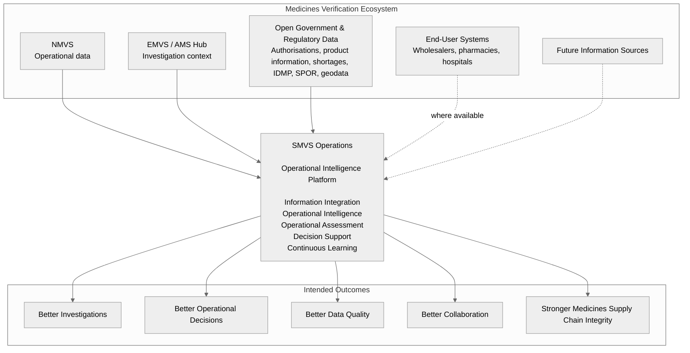

# SMVS Operations  
## Operational Intelligence for the Medicines Verification Ecosystem

**A conceptual architecture for next-generation operational investigations in the medicines verification ecosystem.**

### The Challenge

Medicines verification generates enormous amounts of operational data.

By itself, however, data has limited value. It becomes meaningful operational information only when interpreted within its operational context.

**Transforming fragmented operational information into contextual, actionable intelligence remains one of the major challenges across today's medicines verification ecosystem.**

The medicines verification ecosystem is already highly interconnected. Operational information is distributed across NMVSs, the EMVS ecosystem, regulatory reference sources, MAHs, OBPs, end-user organisations and technical service providers.

The challenge is therefore not primarily a lack of information, but a lack of contextualisation, correlation and operational intelligence.

Today, operational investigations are still largely supported by traditional reports. These reports are often static, difficult to analyse, limited in correlation capabilities and no longer sufficient for modern operational intelligence needs.

---

### The Concept

SMVS Operations is an **Operational Intelligence Platform**.

It transforms operational information from multiple authoritative sources into evidence-based investigation support.

Rather than focusing on individual Alerts or Exceptions, the platform correlates information across the medicines verification ecosystem to establish a comprehensive Investigation Context.

The platform supports investigators through:

- Operational Intelligence
- multidimensional Operational Assessment
- explainable Decision Support
- Continuous Learning from investigation outcomes

Human responsibility for operational decisions remains unchanged.

---

### Big Picture

---

### Operational Intelligence in Practice

SMVS Operations transforms **fragmented operational information** into **contextual operational intelligence**.

Rather than analysing individual observations in isolation, the platform continuously establishes and enriches the relationships between operational information originating from multiple authoritative sources.

Each observation is interpreted within its operational context, considering **when**, **where**, **how**, **by whom** and **under which circumstances** the information was created.

The resulting **Investigation Context** evolves continuously as new information becomes available, enabling investigators to understand operational situations rather than isolated events.

Operational Assessments combine multiple complementary perspectives, including:

- **operational context**
- **behavioural context**
- **technical context**
- **process context**
- **regulatory context**
- **geographical context**
- **data quality context**
- **historical context**
- **operational impact**

This contextual approach enables investigators to distinguish between:

- process deviations
- software or technical issues
- data quality problems
- recurring operational patterns
- indicators of falsification
- indicators of diversion
- emerging risks requiring further investigation

**The objective is not simply to analyse operational information, but to transform it into contextual, actionable intelligence that supports consistent, explainable and evidence-based investigations.**

---

### Why This Matters

SMVS Operations is not intended to replace existing operational systems.

It complements them by creating a structured intelligence layer above the available information sources.

The platform helps transform fragmented operational information into actionable intelligence that supports:

- **faster and more effective investigations**
- **more consistent and explainable assessments**
- **improved root-cause analysis**
- **enhanced collaboration between authorised stakeholders**
- **continuous organisational learning**
- **a foundation for future AI-assisted investigation support**

---

### Beyond Alert Management

**SMVS Operations is not an Alert Management System.**

It is an evidence-based Operational Intelligence Platform for the medicines verification ecosystem.

Its long-term purpose is to support medicines integrity by improving the ability to detect, understand and assess operational situations across the legal supply chain.

This includes not only potential falsification scenarios, but also process deviations, technical issues, data quality problems, recurring operational patterns and future supply chain integrity challenges such as diversion.

---

**Current Status:** Conceptual Reference Architecture completed. Architecture Decision Records ADR-004 to ADR-008 drafted. Functional specifications in progress.