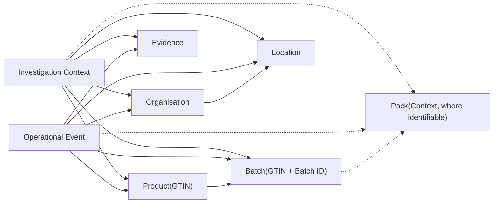

# ADR-005: Operational Information Model

| Attribute          | Value                         |
| ------------------ | ----------------------------- |
| **Document ID**    | ADR-005                       |
| **Title**          | Operational Information Model |
| **Status**         | Draft                         |
| **Version**        | 0.9                           |
| **Classification** | Internal                      |
| **Owner**          | SMVS GmbH                     |
| **Author**         | Reinhold Sojer                |
| **Reviewers**      | TBD                           |
| **Approver**       | TBD                           |

---

# Revision History

| Version | Date       | Author         | Description   |
| ------- | ---------- | -------------- | ------------- |
| 0.9     | 2026-06-26 | Reinhold Sojer | Initial draft |

---

# Context

SMVS Operations integrates information originating from multiple authoritative Information Sources across the medicines verification ecosystem.

Current and planned Information Sources include, but are not limited to:

- Swiss NMVS
- EMVS AMS Hub
- Swissmedic
- VerifyIt
- Future operational information sources

Each Information Source has its own information model, terminology, identifiers and operational purpose. Furthermore, the completeness and granularity of the available information differ considerably between sources.

For example, NMVS reference information provides Product, Batch, Organisation and Location information, whereas individual pack identifiers such as Serial Numbers are typically only available through operational events such as Alerts, Exceptions or Audit Trail records.

Without a common information model, every analytical capability would need to interpret each Information Source individually, leading to duplicated integration logic, inconsistent interpretation and reduced maintainability.

A common conceptual representation of the operational domain is therefore required before analytical processing can take place.

The platform does not own operational information. It maintains an integrated operational representation of information originating from authoritative Operational Information Sources.

---

# Decision

**SMVS Operations shall maintain a source-independent Operational Information Model based on common business entities and contextual investigation concepts.**

SMVS Operations shall establish a unified **Operational Information Model**.

The Operational Information Model provides the common conceptual representation of the medicines verification ecosystem independently of individual Information Sources.

The model distinguishes between:

- persistent Business Entities representing stable operational concepts;
- contextual investigation entities established from operational events and available evidence.

Information obtained from Operational Information Sources shall first be transformed into the Operational Information Model before becoming available to Operational Intelligence.

Business Entities shall be defined independently of implementation details, source-specific schemas and physical database structures.

The Operational Information Model shall provide the common information foundation for all Intelligence Domains and Decision Support capabilities.

---

# Rationale

The Operational Information Model establishes a stable conceptual foundation for the platform.

Rather than modelling individual operational systems, the platform models the business entities and investigation concepts required to support operational investigations.

This architectural approach separates information integration from analytical interpretation and enables all Intelligence Domains to operate on a common representation of the operational environment.

## Independence from Information Sources

Business Entities remain conceptually stable even when new Information Sources are introduced.

The introduction of additional operational systems therefore primarily affects the Information Integration Layer while preserving the Information Model and the Intelligence Domains built upon it.

---

## Separation of Integration and Intelligence

Information integration and operational analysis represent distinct architectural concerns.

The Information Integration Layer is responsible for acquiring, validating, transforming and correlating information originating from multiple Information Sources.

Operational Intelligence operates exclusively on the consolidated Operational Information Model and remains independent of source-specific implementation details.

---

## Support for Contextual Investigations

Not all operational information is available at the same level of granularity.

For example, Products and Batches are persistent Business Entities, whereas Pack Context is typically established only when sufficient identifiers are available through operational events such as Alerts, Exceptions or Audit Trail records.

The Operational Information Model therefore supports both persistent Business Entities and contextual investigation entities without requiring complete pack-level information for every operational investigation.

---

## Extensibility

The Operational Information Model provides a stable conceptual foundation for future evolution.

Additional Information Sources, Business Entities and analytical capabilities can be incorporated without fundamentally changing the architecture or the existing Intelligence Domains.

## Separation of Conceptional and Physical Models

The Operational Information Model is a conceptual model. It does not prescribe the physical analytical data model used for implementation.

The implementation may use an analytical schema, such as a star schema with fact tables and dimensions, to support reporting, analytics and investigation queries. Such implementation-specific data modelling decisions shall be documented in the Software Design Specification.

# Business Entities and Investigation Concepts

The Operational Information Model distinguishes between persistent Business Entities and contextual investigation concepts.

Persistent Business Entities represent stable operational concepts that may exist independently of a specific investigation.

Contextual investigation concepts are established from operational events and available evidence. They may depend on the completeness and granularity of the information available in a specific investigation.

---

## Persistent Operational Entities

| Entity           | Description                                                  | Typical Identifier |
| ---------------- | ------------------------------------------------------------ | ------------------ |
| **Product**      | A medicinal product within the medicines verification ecosystem. A Product is identified by its GTIN. Product represents the primary business entity of the Operational Information Model. Most operational investigations originate from or are correlated to a Product identified by its GTIN. | GTIN               |
| **Batch**        | A production batch associated with a Product. A Batch cannot exist independently of a Product. | GTIN + Batch ID    |
| **Organisation** | An organisation participating in the medicines verification ecosystem, such as an end-user organisation, MAH, OBP or wholesaler. | Organisation ID    |
| **Location**     | A physical or logical location associated with an Organisation. Operational activity is usually associated with a specific Location. | Location ID        |

---

## Contextual Investigation Concepts

| Concept                   | Description                                                  | Typical Identifier                                           |
| ------------------------- | ------------------------------------------------------------ | ------------------------------------------------------------ |
| **Pack Context**          | Context relating to an individual pack. Pack Context is established only when sufficient identifiers are available. Pack Context represents an investigation concept rather than a persistent business entity. | GTIN + Serial Number + Batch ID + Expiry Date, where available |
| **Event**                 | An Event represents an operational occurrence observed within the medicines verification ecosystem.Examples include:- Alerts- Exceptions- Transaction Events- Audit Trail Events- Future Field Intelligence Events | Source-specific identifier, Transaction ID or Event ID       |
| **Evidence**              | Evidence consists of objective information collected during an investigation.Evidence remains distinguishable from Intelligence, Risk Assessment and Decision Support. | Platform-generated identifier                                |
| **Investigation Context** | Contextual representation of an operational investigation established in accordance with ADR-004. | Platform-generated identifierPlatform-generated identifier   |

Pack-level information is not generally available from all Information Sources.

In particular, NMVS reference information and snapshot-style operational extracts typically provide Product, Batch, Organisation and Location information, but not Serial Numbers. Serial Numbers are usually available only where an operational event has occurred, for example through an Alert, Exception, Audit Trail record or future field intelligence event.

The model therefore treats Pack Context as conditional. It can enrich an investigation where sufficient identifiers are available, but it is not required for all operational analyses.

---

# Conceptual Information Model

The following diagram illustrates the conceptual relationship between persistent Business Entities and contextual investigation concepts.

It does not represent a physical database model.

Dashed relationships indicate conditional relationships that depend on the availability of sufficient identifiers.

---

# Entity Identification

The Operational Information Model uses stable business identifiers wherever possible.

| Entity or Concept | Primary Identifier                                           |
| ----------------- | ------------------------------------------------------------ |
| **Product**       | GTIN                                                         |
| **Batch**         | GTIN + Batch ID                                              |
| **Organisation**  | Organisation ID                                              |
| **Location**      | Location ID                                                  |
| **Pack Context**  | GTIN + Serial Number + Batch ID + Expiry Date, where available |
| **Event**         | Source-specific identifier, Transaction ID or Event ID       |
| **Evidence**      | Platform-generated identifier                                |
| **Investigation** | Platform-generated identifier                                |

The chosen identifiers represent conceptual identifiers rather than implementation-specific database keys.

Where source systems provide different identifiers or incomplete information, the Information Integration Layer is responsible for mapping and correlating the available information into the Operational Information Model.

# Consequences

## Positive

- Provides a common conceptual information model across all Information Sources.
- Establishes a stable foundation for all Intelligence Domains.
- Separates source-specific integration from analytical interpretation.
- Supports Product-, Batch-, Organisation-, Location- and Event-based investigations.
- Enables Pack-level investigations where sufficient identifiers are available.
- Reduces duplication of mapping and interpretation logic.
- Improves consistency of terminology throughout the platform.
- Supports future integration of additional Information Sources.
- Supports future evolution of the Investigation Context and Decision Support capabilities.

---

## Negative

- Information from different sources must be mapped and correlated before it can be used consistently.
- Source-specific semantics may require additional transformation logic.
- Entity resolution may become complex where identifiers are incomplete, inconsistent or source-specific.
- Some investigations may remain limited by incomplete information.
- Pack-level context cannot be assumed for all investigations.

---

# Related Documents

This Architecture Decision Record is based on the conceptual principles defined in:

- ARCH-001 Conceptual Reference Architecture

It provides the conceptual basis for:

- ADR-006 Operational Intelligence Layer
- ADR-007 Operational Risk Intelligence
- ADR-008 AI-assisted Decision Support
- URS-001 User Requirements Specification
- Functional Requirements Specifications
- Software Design Specifications
- Validation documentation

---

# Future Evolution

The Operational Information Model is expected to evolve as additional Information Sources, Intelligence Domains and operational use cases are introduced.

Future extensions may include:

- additional business entities
- additional contextual investigation concepts
- additional relationships between existing entities
- improved entity resolution
- enhanced correlation across Information Sources
- additional pack-level investigation capabilities where sufficient identifiers are available
- additional Operational Information categories

Such extensions shall preserve the distinction between persistent Business Entities and contextual investigation concepts.

The conceptual principles established by this ADR shall remain unchanged unless the underlying operational investigation model changes fundamentally.

