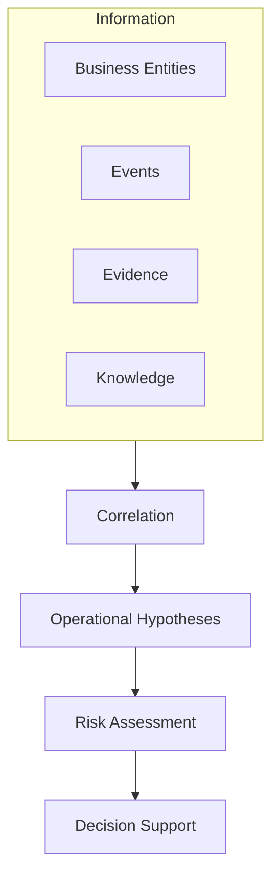
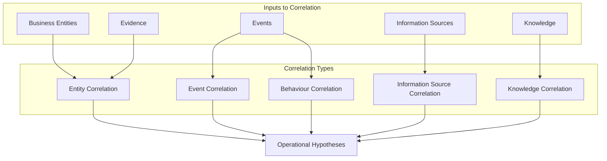

# ADR-006: Operational Intelligence Model

| Attribute          | Value                                          |
| ------------------ | ---------------------------------------------- |
| **Document ID**    | ADR-006                                        |
| **Title**          | Operational Intelligence and Correlation Model |
| **Status**         | Draft                                          |
| **Version**        | 0.9                                            |
| **Classification** | Internal                                       |
| **Owner**          | SMVS GmbH                                      |
| **Author**         | Reinhold Sojer                                 |
| **Reviewers**      | TBD                                            |
| **Approver**       | TBD                                            |

---

# Revision History

| Version | Date       | Author         | Description   |
| ------- | ---------- | -------------- | ------------- |
| 0.9     | 2026-06-26 | Reinhold Sojer | Initial draft |

---

# Context

The Operational Information Model defined in ADR-005 provides a consolidated and source-independent representation of the medicines verification ecosystem.

However, consolidated information alone does not provide operational understanding.

Operational investigations require information originating from multiple Business Entities, Information Sources and operational events to be analysed together in order to establish an Investigation Context.

Examples include:

- correlating Product information with regulatory reference data
- relating Batch information to operational events
- identifying operational relationships between Organisations and Locations
- recognising behavioural patterns across multiple Events
- combining operational evidence with organisational knowledge

Operational Intelligence therefore requires more than information retrieval. It requires systematic correlation of information originating from multiple sources and analytical perspectives.

---

# Decision

SMVS Operations shall establish an **Operational Intelligence and Correlation Model**.

Operational Intelligence shall be generated through the correlation of information, evidence and organisational knowledge rather than through isolated analysis of individual operational events.

Correlation is the primary mechanism for establishing relationships between Operational Information. 

Operational Intelligence emerges through the interpretation of correlated Operational Information within its operational context.

Operational Intelligence shall support investigators by establishing contextual operational hypotheses that can subsequently be evaluated through Risk Assessment and presented through Decision Support capabilities.

Operational Intelligence shall remain transparent, explainable and traceable to the underlying operational evidence.

---

## Rationale

The primary objective of the platform is not to collect operational information but to generate meaningful operational understanding.

Individual operational events rarely provide sufficient evidence to support operational decision making.

Instead, operational understanding emerges through the correlation of information originating from multiple Business Entities, Information Sources and Intelligence Domains.

This approach reflects the actual investigative workflow of an NMVO, where operational conclusions are established by progressively combining available evidence rather than evaluating isolated alerts or exceptions.

---

## Correlation as the Primary Analytical Principle

Correlation represents the central analytical capability of the platform.

Rather than analysing Alerts, Exceptions or operational transactions independently, the platform continuously establishes relationships between:

- Business Entities
- Operational Events
- Information Sources
- Investigation Context
- Organisational Knowledge

Operational Intelligence is therefore an emergent property resulting from the correlation of operational information.

---

## Operational Hypotheses

Operational Intelligence may establish one or more Operational Hypotheses where multiple plausible explanations exist.

Typical hypotheses may include:

- operational process deviation
- technical integration issue
- data quality issue
- synchronisation problem
- suspicious operational behaviour
- increased counterfeit risk

Operational hypotheses provide structured analytical support for investigators while preserving human responsibility for operational decisions.

# Correlation Principles

The Operational Intelligence and Correlation Model is based on the principle that operational understanding emerges through the correlation of multiple independent observations rather than isolated operational events.

Each correlation contributes additional context to an Investigation. Correlations are cumulative and may strengthen, weaken or refine one or more operational hypotheses. The architecture intentionally does not prescribe specific correlation algorithms or analytical techniques.

---

## Entity Correlation

Entity Correlation establishes relationships between Business Entities.

Examples include:

- Product ↔ Regulatory Reference Information → Product master data inconsistency
- Batch ↔ Multiple operational events across different organisations → Potential batch-related quality issue
- Organisation ↔ Historical operational behaviour → Recurring operational process deviation
- Similar operational patterns observed across multiple Products, Organisations or Locations → Common underlying operational cause
- Operational evidence ↔ Organisational Knowledge → Previously known operational scenario with established investigation guidance

Entity Correlation establishes the structural context of an investigation.

---

## Event Correlation

Event Correlation analyses relationships between operational events.

Examples include:

- repeated Exceptions
- recurring Alerts
- transaction history
- operational sequences
- Audit Trail relationships

Event Correlation establishes the temporal context of an investigation.

---

## Behaviour Correlation

Behaviour Correlation analyses operational behaviour across multiple events.

Examples include:

- repeated operational patterns
- unusual verification behaviour
- geographical patterns
- temporal patterns
- recurring operational scenarios

Behaviour Correlation supports operational risk assessment by identifying deviations from expected operational behaviour.

---

## Information Source Correlation

Information Source Correlation combines information originating from different authoritative Information Sources.

Examples include:

- Product information ↔ Swissmedic
- Product ↔ AMS Hub
- Product ↔ VerifyIt
- Batch ↔ operational events

Information Source Correlation increases confidence and completeness of the Investigation Context.

---

## Knowledge Correlation

Knowledge Correlation combines operational evidence with organisational knowledge.

Examples include:

- known operational scenarios
- investigation guidelines
- lessons learned
- product-specific experience
- historical investigations

Knowledge Correlation supports consistent operational investigations across different investigators.

---

# Operational Intelligence

Operational Intelligence emerges through the cumulative correlation of information originating from multiple analytical perspectives.

No individual correlation is expected to establish a complete operational understanding.

Instead, each correlation contributes additional evidence supporting or challenging one or more operational hypotheses.

Operational Intelligence therefore represents a continuously evolving analytical view of the Investigation Context.

---

# Correlation Characteristics

The Operational Intelligence and Correlation Model follows the principles below.

## Incremental

Operational Intelligence evolves as additional information becomes available.

---

## Context-driven

Each additional correlation contributes contextual understanding rather than replacing previous observations.

---

## Explainable

Every analytical conclusion shall remain traceable to the underlying operational evidence and contributing correlations.

---

## Technology-independent

Correlation mechanisms may be implemented using deterministic rules, statistical methods, artificial intelligence or future analytical techniques.

The conceptual architecture remains independent of the underlying implementation.

---

## Continuous Learning

Operational Intelligence shall continuously improve through:

- investigation outcomes
- newly available Information Sources
- organisational knowledge
- emerging operational patterns
- analytical improvements

Continuous Learning strengthens future investigations while preserving traceability and explainability.