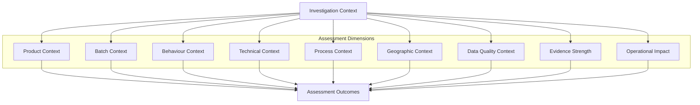

# ADR-007: Operational Assessment Model

| Attribute          | Value                        |
| ------------------ | ---------------------------- |
| **Document ID**    | ADR-007                      |
| **Title**          | Operational Assessment Model |
| **Status**         | Draft                        |
| **Version**        | 0.9                          |
| **Classification** | Internal                     |
| **Owner**          | SMVS GmbH                    |
| **Author**         | Reinhold Sojer               |
| **Reviewers**      | TBD                          |
| **Approver**       | TBD                          |

---

# Revision History

| Version | Date       | Author         | Description   |
| ------- | ---------- | -------------- | ------------- |
| 0.9     | 2026-06-26 | Reinhold Sojer | Initial draft |

---

# Context

ADR-006 defines how Operational Intelligence is generated through the correlation of information, evidence and organisational knowledge.

Operational Intelligence may establish one or more Operational Hypotheses together with contextual understanding of the operational situation.

However, the existence of an Operational Hypothesis does not, by itself, determine the appropriate operational response.

Investigators must assess multiple aspects of the situation, including the available evidence, the operational context, potential causes and the possible impact before determining whether further investigation or operational action is justified.

Operational Assessment therefore represents the structured evaluation of Operational Hypotheses prior to Decision Support.

---

# Decision

SMVS Operations shall establish an **Operational Assessment Model**.

Operational Assessment shall evaluate Operational Hypotheses using multiple independent Assessment Dimensions rather than relying on individual operational events or predefined alert classifications.

The purpose of Operational Assessment is to support consistent, transparent and explainable operational evaluations while preserving human responsibility for all operational decisions.

The conceptual architecture shall remain independent of specific assessment algorithms, scoring models, thresholds or implementation technologies.

---

# Rationale

Operational investigations require professional judgement.

The same Alert or Exception may require completely different operational responses depending on the available evidence, operational context and likely underlying cause.

Operational Assessment therefore evaluates the complete Investigation Context rather than isolated operational events.

This approach supports consistent investigations while allowing the assessment methodology to evolve as operational knowledge increases.

---

# Assessment Principles

Operational Assessment follows the principles below.

## Context-driven

Operational situations shall be assessed within their complete Investigation Context.

Individual Alerts or Exceptions shall not be evaluated in isolation.

---

## Multi-dimensional

Operational Assessment shall consider multiple Assessment Dimensions simultaneously.

No individual dimension is expected to determine the outcome independently.

---

## Evidence-based

Assessments shall be based on objective operational evidence obtained through the Operational Intelligence process.

---

## Explainable

Every assessment shall remain understandable and traceable to the underlying evidence, correlations and Operational Hypotheses.

---

## Technology-independent

The conceptual architecture intentionally does not prescribe implementation techniques.

Operational Assessment may be implemented using deterministic rules, expert knowledge, statistical analysis, artificial intelligence or future analytical methods without affecting the conceptual architecture.

# Assessment Dimensions

The applicable Assessment Dimensions depend on the operational situation under investigation.

Not every Assessment Dimension is expected to contribute to every Operational Assessment.

Operational Assessment evaluates an Investigation Context from multiple complementary perspectives.

Each Assessment Dimension contributes additional understanding of the operational situation.

No single Assessment Dimension is expected to determine the outcome of an Operational Assessment.

The relative importance of each dimension depends on the operational scenario under investigation.

---

## Product Context

Evaluates characteristics of the Product involved in the investigation.

Examples include:

- therapeutic category
- high-value medicines
- known counterfeit targets
- medicines shortage information
- regulatory product information
- Marketing Authorisation Holder (MAH)
- Onboarding Partner (OBP)

---

## Batch Context

Evaluates information related to the production batch.

Examples include:

- batch availability
- batch upload history
- unusual batch behaviour
- known batch-related issues
- operational history

---

## Behaviour Context

Evaluates behavioural patterns observed across operational events.

Examples include:

- repeated operational behaviour
- unusual verification patterns
- systematic scanning activities
- recurring operational scenarios
- behavioural anomalies

---

## Technical Context

Evaluates technical aspects potentially influencing operational behaviour.

Examples include:

- software platforms
- scanner configuration
- automated dispensing systems
- equipment characteristics
- known software defects
- known technical incidents

---

## Process Context

Evaluates operational workflows.

Examples include:

- MAH onboarding
* Batch upload process
* Investigation workflow
- Double Dispense scenarios
- Inter-Market Transactions (IMT)
- known operational procedures
- expected business processes
- workflow deviations

---

## Geographic Context

Evaluates geographical relationships associated with an investigation.

Examples include:

- neighbouring Locations
- cross-border activities
- IMT relationships
- country-specific operational characteristics
- regional distribution patterns

---

## Data Quality Context

Evaluates the quality and completeness of operational information.

Examples include:

- Product information
- Batch information
- synchronisation issues
- missing master data
- operational consistency
- conflicting information
* incomplete information

---

## Evidence Strength

Evaluates the completeness and consistency of the available operational evidence.

Examples include:

- number of independent observations
- consistency of available evidence
- corroborating Information Sources
- conflicting observations
- completeness of Investigation Context

---

## Operational Impact

Evaluates the potential operational consequences.

Examples include:

- patient safety considerations
- operational disruption
- supply chain impact
- investigation effort
- regulatory implications

---

# Assessment Outcomes

Operational Assessment supports investigators by producing structured assessment outcomes.

Typical outcomes include:

- Operational Relevance
- Likely Cause
- Investigation Priority
- Operational Risk
- Recommended Next Steps
- Need for Additional Evidence
- Confidence

Operational Assessment supports professional judgement.

It does not replace human decision making.

---

# Conceptual Assessment Model

The following diagram illustrates the conceptual relationship between Operational Intelligence and Operational Assessment.

Operational Assessment represents a multidimensional evaluation of an Investigation Context.

The architecture intentionally avoids prescribing weighting mechanisms, scoring models or analytical algorithms.

---

# Consequences

## Positive

- Supports structured and consistent operational assessments.
- Separates Operational Intelligence from Operational Assessment.
- Allows assessment methodologies to evolve independently of the conceptual architecture.
- Supports explainable operational evaluations.
- Enables future implementation using deterministic rules, expert systems, statistical methods or Artificial Intelligence.
- Provides a common conceptual language for investigators.

---

## Negative

- Multiple Assessment Dimensions may increase implementation complexity.
- Some Assessment Dimensions may not always be available.
- Assessment methodologies require continuous refinement as operational knowledge evolves.

---

# Related Documents

This Architecture Decision Record extends:

- ARCH-001 – Conceptual Reference Architecture
- ADR-004 – Operational Investigation Context
- ADR-005 – Operational Information Model and Business Entities
- ADR-006 – Operational Intelligence and Correlation Model

The Operational Assessment Model provides the conceptual basis for:

- ADR-008 – Operational Decision Support Model
- User Requirements Specification
- Functional Requirements Specifications

---

# Future Evolution

Operational Assessment is expected to evolve continuously as additional operational knowledge becomes available.

Future evolution may include:

- additional Assessment Dimensions
- improved assessment methodologies
- new Information Sources
- new correlation patterns
- organisation-specific knowledge
- AI-assisted assessment support

The conceptual principles established by this ADR shall remain independent of implementation technologies and analytical methods.