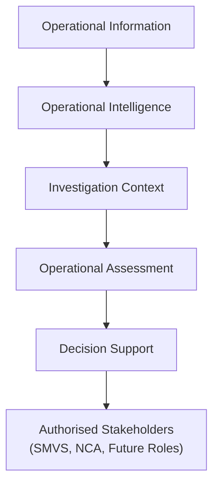

# ADR-008: Operational Decision Support Model

| Attribute          | Value                              |
| ------------------ | ---------------------------------- |
| **Document ID**    | ADR-008                            |
| **Title**          | Operational Decision Support Model |
| **Status**         | Draft                              |
| **Version**        | 0.9                                |
| **Classification** | Internal                           |
| **Owner**          | SMVS GmbH                          |
| **Author**         | Reinhold Sojer                     |
| **Reviewers**      | TBD                                |
| **Approver**       | TBD                                |

---

# Revision History

| Version | Date       | Author         | Description   |
| ------- | ---------- | -------------- | ------------- |
| 0.9     | 2026-06-26 | Reinhold Sojer | Initial draft |

---

# Context

ADR-007 defines how Operational Assessments are established through the structured evaluation of an Investigation Context from multiple complementary Assessment Dimensions.

Operational Assessment provides investigators with a structured understanding of an operational situation, including its likely causes, operational significance, supporting evidence and potential impact.

Operational decisions, however, require this assessment to be communicated in a manner that is understandable, explainable and actionable for authorised investigators and other stakeholders.

Operational Decision Support therefore represents the communication of Operational Intelligence and Operational Assessment rather than an additional analytical process.

Its purpose is to provide investigators with the contextual information, explanations and recommendations required to support consistent, evidence-based operational decisions while preserving human responsibility for all operational actions.

---

# Decision

SMVS Operations shall establish an **Operational Decision Support Model**.

Decision Support shall present Operational Intelligence and Operational Assessment in a manner that enables investigators to make informed operational decisions.

Decision Support shall provide sufficient context for investigators to understand not only recommended actions but also the underlying reasoning, evidence and assessment that led to those recommendations.

Decision Support provides the analytical foundation for operational decisions, while Investigation Management supports the documentation, coordination and follow-up of the resulting investigation activities.

The platform shall remain advisory in nature and shall not perform autonomous operational decisions.

---

# Rationale

Operational investigations require transparency and explainability.

Investigators must understand not only the recommended course of action but also the evidence, correlations and assessments that contributed to that recommendation.

Decision Support therefore represents the presentation and communication of analytical results rather than an additional analytical process.

---

# Decision Support Principles

## Human-centred

Decision Support shall assist investigators while preserving human responsibility for operational decisions.

---

## Explainable

Recommendations shall remain traceable to the underlying Investigation Context, Operational Intelligence and Operational Assessment.

---

## Evidence-based

Recommendations shall always be supported by objective operational evidence.

---

## Action-oriented

Decision Support shall assist investigators in determining appropriate next steps rather than merely presenting information.

---

## Technology-independent

Decision Support may be implemented using dashboards, reports, workflows, expert systems, Artificial Intelligence or future technologies without affecting the conceptual architecture.

---

# Typical Decision Support Outputs

Decision Support may provide outputs such as:

- investigation summaries
- recommended next steps
- operational observations
- identified operational patterns
- relevant historical investigations
- related operational events
- supporting evidence
- assessment results
- reporting and dashboards
- confidence indicators
- alternative operational hypotheses

The platform intentionally avoids prescribing the presentation format.

---

# Conceptual Decision Support Model

Decision Support represents the interaction between the platform and the investigator.

The investigator remains responsible for all operational decisions.

---

# Consequences

## Positive

- Supports consistent operational investigations.
- Improves transparency and explainability.
- Separates analytical processing from human decision making.
- Enables future AI-assisted recommendations while preserving human oversight.
- Supports continuous operational improvement through structured investigations.

---

## Negative

- Recommendations depend on the completeness and quality of available information.
- Decision Support cannot eliminate uncertainty in operational investigations.
- Human expertise remains essential for complex operational scenarios.

---

# Related Documents

This Architecture Decision Record extends:

- ARCH-001 – Conceptual Reference Architecture
- ADR-004 – Operational Investigation Context
- ADR-005 – Operational Information Model
- ADR-006 – Operational Intelligence and Correlation Model
- ADR-007 – Operational Assessment Model

The Decision Support Model provides the conceptual basis for:

- User Requirements Specification
- Functional Requirements Specifications
- Investigation Workflows
- Reporting and Dashboard Design
- AI-assisted Investigation Support

---

# Future Evolution

Decision Support is expected to evolve continuously as new operational knowledge, analytical capabilities and user experience become available.

Future evolution may include:

- AI-assisted recommendations
- interactive investigation workspaces
- collaborative investigations
- adaptive dashboards
- personalised investigator views
- explainable AI capabilities

The conceptual principles established by this ADR shall remain independent of implementation technologies.